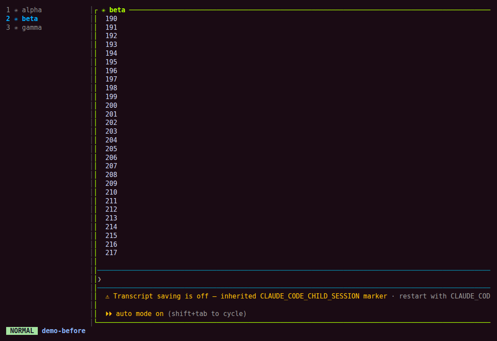
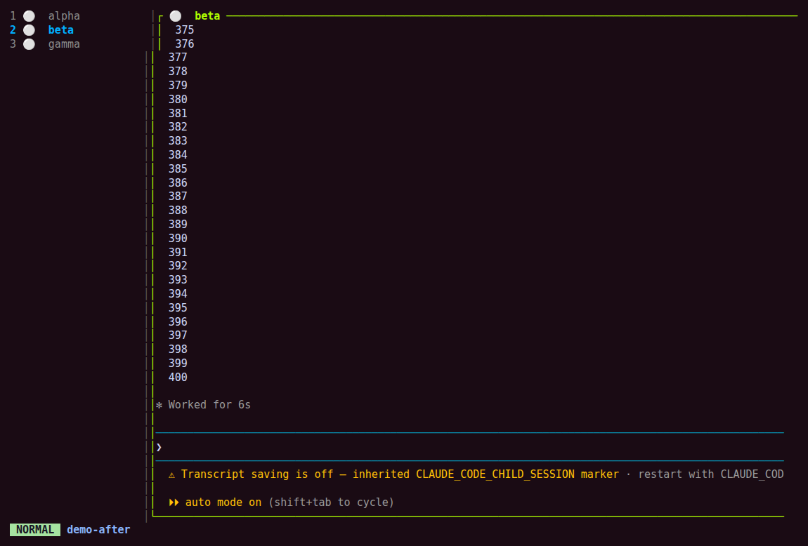

# zellij x1

A persistent, multi-tab [Zellij](https://zellij.dev) workspace, `x1`, in which
every tab resumes **its own Claude Code conversation** after a detach, a
`Ctrl+q`, or a full reboot — plus a per-tab running/idle indicator in the
sidebar so you can tell which tabs are working without switching to them.

Built and verified on Zellij **0.44.1** (snap), **Linux**, bash, Claude Code
**v2.1.241**. Nothing here has been tested on other platforms or versions.

## The problem this solves

Zellij persists a dead session by serializing the **command line** of each
pane, not its process. A pane started with a bare `claude` resurrects as a
bare `claude` — a brand-new, empty conversation, with no memory of what was
running before. Zellij also brings resurrected command panes back with
`start_suspended true`, so each one waits for an ENTER press.

The fix is `ccs`, a slot wrapper: `ccs <slot>` derives a stable UUID from the
slot name (or reads an override), and always launches Claude with
`--resume <uuid>`. Because the resolved, idempotent command line is what gets
serialized, resurrection replays the same `--resume` and the conversation
picks up where it left off. See [docs/DESIGN-NOTES.md](docs/DESIGN-NOTES.md)
for the trap this works around and why the design isn't simpler.

Three goals, in order of how much design effort they cost:

1. New tabs open with a vertical sidebar on the left (`zellij-vertical-tabs`, 22 cols).
2. A running/idle indicator per tab, driven by Claude Code hooks.
3. Session persistence — both the Zellij layout and every Claude conversation
   in it — across detach, `Ctrl+q`, and reboot.

## Requirements

- Zellij 0.44.1+ (KDL layout syntax, `permissions.kdl`, `serialize_pane_viewport`)
- Claude Code (tested against v2.1.241), with `--session-id`, `--resume`, `--name`, and hooks support
- bash, `curl`, `awk`, `sed`, `sha1sum`, `python3` (install script only)

## Install

```bash
./install.sh
```

Idempotent, and backs up every file it touches as `<file>.bak-<date>` before
changing it. It:

- installs `ccs` and `ccs-state` to `~/.local/bin/`
- installs `layouts/x1.kdl` to `~/.config/zellij/layouts/`
- fetches the two plugin `.wasm` files (see Plugins, below) into `~/.config/zellij/plugins/`
- installs `zellij/permissions.kdl` to `~/.cache/zellij/permissions.kdl`
- appends `zellij/config.kdl.fragment` to `~/.config/zellij/config.kdl` (serialization settings)
- appends the `zj` alias to `~/.bashrc`
- merges `claude/settings.hooks.json` into `~/.claude/settings.json` (four hooks — see Running indicator)

Open a new shell (to pick up the `zj` alias) and run `zj`.

## Files in this repo

| Path | Installed to | Purpose |
|---|---|---|
| `install.sh` | — | Idempotent installer, see above |
| `bin/ccs` | `~/.local/bin/ccs` | Slot wrapper — pins one Claude conversation per slot name |
| `bin/ccs-state` | `~/.local/bin/ccs-state` | Hook helper — paints the running/idle indicator |
| `layouts/x1.kdl` | `~/.config/zellij/layouts/x1.kdl` | Seed layout, read only on first creation |
| `plugins/fetch-plugins.sh` | — | Downloads the two prebuilt plugin `.wasm` files |
| `zellij/config.kdl.fragment` | appended to `~/.config/zellij/config.kdl` | Serialization settings |
| `zellij/permissions.kdl` | `~/.cache/zellij/permissions.kdl` | Pre-granted plugin permissions |
| `claude/settings.hooks.json` | merged into `~/.claude/settings.json` | The four `ccs-state` hooks |
| `claude-slots.example` | — (not installed) | Template for `~/.config/claude-slots`, which is gitignored |
| `shell/bashrc.fragment` | appended to `~/.bashrc` | The `zj` alias |

`~/.config/claude-slots` itself is created at runtime by `ccs`, not by the
installer — see Security, below.

## Usage

`zj` is one command for every state the `x1` session can be in:

| State of `x1` | Command run | Result |
|---|---|---|
| Live | `zellij attach -f x1` | Exact state, live processes |
| Exited | `zellij attach -f x1` | Layout resurrected; `-f` force-runs panes past `start_suspended`; conversations resume |
| Absent | `zellij -s x1 -n x1` | Fresh build from `x1.kdl` |

- **New tab:** `Ctrl+t` `n`, then `ccs <slot>` (e.g. `ccs api`). No
  registration step — the slot derives its own UUID from its name on first
  use and is pinned from then on.
- **Close a tab:** `Ctrl+t` `x`. **Close a pane:** `Ctrl+p` `x`.
- **Detach:** `Ctrl+o` `d`. **End of day:** `Ctrl+q`.
- Removing a tab is reversible: the conversation stays on disk, and
  `ccs <same-slot>` in a new tab picks it back up.

**The one rule: start Claude with `ccs <slot>`, never bare `claude`.** A bare
`claude` pane serializes with no session id and resurrects as an empty
conversation. The working/idle indicator does **not** depend on this — it
works for every Claude pane, `ccs` or not (see F15).

`x1.kdl` is a **seed** — read only when the session is created from nothing.
After that, Zellij serializes the live session every 60s and resurrection
replays *that*, so hand-added tabs persist by themselves without ever being
added to the layout file. To pick up an edit to `x1.kdl`:

```bash
zellij delete-session -f x1 && zj
```

**Never wind down by closing panes one at a time.** Re-serialization runs
every 60s in the background; closing panes gradually risks a serialization
landing mid-teardown and saving a shrinking workspace over the good one.
Use `Ctrl+q` to end the whole session at once instead.

## Running indicator

The sidebar shows per-tab agent state, driven by Claude Code hooks rather
than Claude's own terminal title (which cannot express it — see
[DESIGN-NOTES.md, finding F4](docs/DESIGN-NOTES.md#f4-the--in-claudes-terminal-title-is-not-a-running-indicator)):

| Sidebar | Meaning |
|---|---|
| `🟢 <label>` | agent is generating |
| `⚪ <label>` | idle, waiting for you |

`<label>` is, in order of priority: a registered slot name, Claude's own
session name (what `/rename` writes, and what `ccs` passes as `--name`), or
the pane's cwd basename as a last resort.

**Before** — the sidebar showing Claude's own terminal title. All three tabs
read `✳`, including tab 2, which is mid-generation at that instant. The
glyph is identical whether a tab is working or idle, so it cannot tell you
which one is busy.



**After, idle** — every tab at rest.



**After, working** — tab 2 is generating; tabs 1 and 3 are idle.


`bin/ccs-state` is the hook helper, wired into `~/.claude/settings.json`:

| Event | State |
|---|---|
| `SessionStart` | idle |
| `UserPromptSubmit` | working |
| `PostToolUse` | working |
| `Stop` | idle |

It renames the pane with `zellij action rename-pane -p "$ZELLIJ_PANE_ID"` —
targeting the pane **by id**, so it never steals focus from another tab and
works for background tabs. It maps the Claude `session_id` it receives on
stdin to a slot name via `~/.config/claude-slots` (the same file `ccs`
appends to); failing that, to Claude's own session name, read from
`~/.claude/sessions/<pid>.json`; failing that, to the cwd basename. It
no-ops only when there's no Zellij pane id in the environment — so the
hooks are safe to have installed globally, and the indicator works for
**every** Claude pane in a Zellij session, not only ones started with `ccs`.

**One rename touches three surfaces at once:** the sidebar row, the pane's
own frame header, and the terminal window title all update together, since
all three read the same pane name.

**`Ctrl+t R` (Zellij's own rename-tab) never changes the sidebar.**
`zellij-vertical-tabs`'s format strings only expose `{count}`, `{index}`,
`{indicators}`, and `{name}` — and `{name}` resolves to the *focused pane*,
not the tab. `/rename` is the only user-facing control over the label, and
it lags by one message: it fires no hook, so the row only repaints on the
next `UserPromptSubmit` or `Stop`. Sending any message in that pane corrects
it immediately.

**Split panes collapse to one row.** The sidebar shows one row per *tab*,
reflecting whichever pane is focused. A tab with two Claude panes — one
working, one idle — shows only the focused pane's state; each pane's own
frame header still shows its own true state.

**Claude auto-names sessions that share a directory** (`code`, `code-76`,
`code-ea`, …), which is why the cwd-basename fallback above is rarely
reached in practice — a name is almost always already present.

**Tradeoff:** the pane title is now always `<state> <label>`. Claude's own
title — a live summary of the current task, e.g. `✳ What's going on` — is no
longer shown. `zellij action undo-rename-pane -p <id>` restores it for one
pane; removing the hooks restores it everywhere.

**`Notification` is deliberately not hooked.** It fires on ordinary turn
completion, not only when input is genuinely needed, so a third
"needs-attention" state built on it became the resting state in testing.

**Hook changes need a pane restart.** A Claude session reads its hook
configuration at startup, so already-running panes keep the old behaviour
until relaunched.

## Plugins

| Plugin | Version | Source | Role |
|---|---|---|---|
| zellij-vertical-tabs | v0.1.0 | https://github.com/cfal/zellij-vertical-tabs | Left sidebar, 22 cols |
| zjstatus | v0.24.0 | https://github.com/dj95/zjstatus | Bottom status bar: mode, session, git branch, clock |

Both are installed from prebuilt release `.wasm` files, deliberately — this
machine's cargo is 1.66, and both plugins need the `wasm32-wasip1` target on
a newer toolchain. No Rust build is required to use this repo as-is.

## Not used: the plugin's activity rows

`zellij-vertical-tabs` master (as of June 2026, PR #3 "activity-sidebar")
adds an `activity` pipe and `activity_format`, addressed by session+tab name,
so a hook could update an unfocused tab's row directly — and unlike the
`format`/`format_active` rows used here, activity rows are substituted
*before* colour parsing, so they could carry real `#[fg=…]` colour codes.

The installed v0.1.0 release (Feb 2026) does not have this — verified: no
`activity` strings in the shipped `.wasm`. A master build is available from
the project's CI artifacts (artifact id `7935060782`, built 2026-06-28,
**expires 2026-09-26**); a copy is stashed locally at
`~/.config/zellij/plugins/zellij-vertical-tabs.master-20260628.wasm`. After
that date, using master would require `rustup update` (edition 2024 needs
Rust ≥1.85; this machine has 1.66 with rustup present).

This is a considered-and-deferred option, not a TODO: the rename-pane
approach in this repo needs no plugin rebuild and no toolchain upgrade, and
was preferred for that reason. See
[DESIGN-NOTES.md](docs/DESIGN-NOTES.md#deferred-the-plugins-activity-rows)
for the rest of the reasoning.

## Security

This repo is public. `~/.config/claude-slots` is **gitignored** — it maps
slot names, which tend to encode what you're working on, to conversation
UUIDs. `claude-slots.example` is committed in its place as a template; copy
it to `~/.config/claude-slots` to pre-adopt existing conversations, or just
let `ccs` create entries as you go. The setup contains no credentials or
tokens.

## Rollback

Delete:

- `~/.local/bin/ccs`
- `~/.local/bin/ccs-state`
- `~/.config/claude-slots`
- `~/.config/zellij/layouts/x1.kdl`
- `~/.config/zellij/plugins/*.wasm`
- `~/.cache/zellij/permissions.kdl`

Restore the `.bak-<date>` files for `~/.config/zellij/config.kdl`,
`~/.bashrc`, and `~/.claude/settings.json`.

To drop only the running indicator and get Claude's own titles back: remove
the four hooks from `~/.claude/settings.json`, then
`zellij action undo-rename-pane -p <id>` per pane (or just restart the
session).

**Nothing in this setup ever modifies or deletes anything under
`~/.claude/projects/`.** The worst case, at any point, is going back to
typing `claude` by hand — every conversation stays intact.

## Further reading

[docs/DESIGN-NOTES.md](docs/DESIGN-NOTES.md) has the full empirical record:
every verified finding, the traps that shaped `ccs` and `ccs-state`, and the
options that were tried and rejected.
